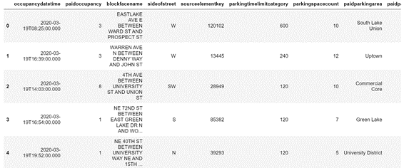
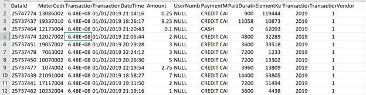

# Parking Lot Occupancy Project in Seattle

* **Where can I find a parking spot near me?**
* **Where is a street/block to find a parking spot right now? or in 1 hour?**
* **How much will parking cost?**

*This project is a part of **Data Engineering Program** run by Springboard.
(October Cohort 2020)*

## Data Source

#### Street Parking Occupancy data (Processed data)
[Data Source Link](https://data.seattle.gov/Transportation/2020-Paid-Parking-Occupancy-Year-to-date-/wtpb-jp8d)
* Seattle.gov update the data with a week delay.
* Granularity of the data is by minute.
* About 131 million records in a year. (~18GB)
* Approx total of 1.4 billion records since 2012. (~320GB)



#### Street Parking Transaction data (Raw data)
[Data Source Link](http://www.seattle.gov/Documents/Departments/SDOT/ParkingProgram/data/SeattlePaidTransactMetadata.pdf)
* Updated daily in the morning.





## How to run DataCollection.py

* To download subset of the dataset (Last 48 hours)
```
python DataCollection.py --debug
```

* To download entire dataset for 2020
```
python DataCollection.py

```